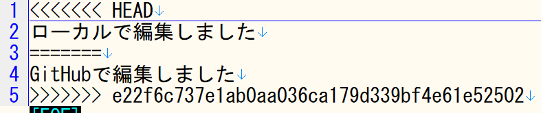

# gitのコンフリクトの練習です

1. README.mdを追加してプロジェクトを作成してください。

   
   
3. プロジェクトをクローンしてください
4. README.mdをGitHub上で編集してください

  
  
4. README.mdの同じ場所をローカルで違う文章に編集してください

  
  
5. ローカルの変更をcommitしてください
6. プッシュしようとして失敗してください。
7. ローカルでプルをしてコンフリクトを起こしてください

  
  
8. コンフリクトを修正して、ローカルの変更にしてください

  
  
9. コミットとプッシュをしてください
10. GitHubで「Insights」-「Network」を見て、２つに分岐したものが一つに繋がったことを確認してください。

 
